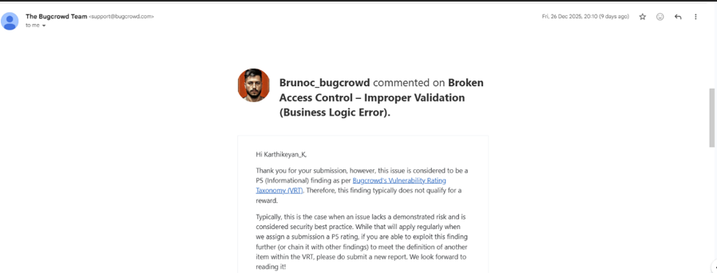
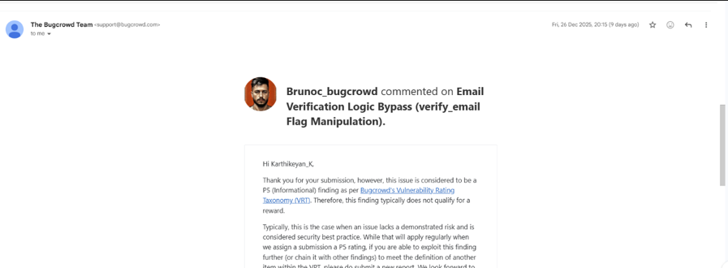

# NASA Vulnerability Disclosure Program

## Overview

As part of my ongoing cybersecurity research and vulnerability assessment activities, I participated in the NASA Vulnerability Disclosure Program, performing authorized security testing on publicly accessible in-scope web applications.

The objective of the assessment was to analyze application behavior, evaluate implemented security controls, and identify potential weaknesses that could affect the security and integrity of application workflows.

---

## Assessment Methodology

The assessment was conducted using a structured web application security testing approach that included:

### Reconnaissance & Enumeration

* Asset discovery and application mapping
* Endpoint identification and analysis
* Attack surface assessment
* Technology fingerprinting

### Application Security Analysis

* Workflow analysis
* Request and response inspection
* Input validation assessment
* Authentication control review
* Authorization validation
* Business logic evaluation

### Manual Security Testing

* Application behavior analysis
* Security control verification
* Workflow manipulation testing
* Logical constraint validation
* Vulnerability verification and impact assessment

---

## Research Outcome

During the assessment process, a logical validation weakness was identified within an application workflow. The issue demonstrated how specific application behaviors could deviate from expected security controls under particular conditions.

The finding was responsibly disclosed through the official NASA Vulnerability Disclosure Program and subsequently reviewed by the program security team.

To comply with responsible disclosure requirements, technical details, affected assets, proof-of-concept information, and reproduction steps have been intentionally omitted.

---

## Skills Demonstrated

* Web Application Security Testing
* Vulnerability Assessment
* Security Research
* Business Logic Analysis
* Authentication Testing
* Authorization Testing
* Reconnaissance & Enumeration
* Request & Response Analysis
* Technical Documentation
* Responsible Disclosure

---

## Key Learning Outcomes

Participation in the NASA Vulnerability Disclosure Program provided practical exposure to real-world security testing methodologies and vulnerability research processes.

This experience strengthened my understanding of:

* Application security assessment methodologies
* Security control validation
* Vulnerability reporting workflows
* Responsible disclosure practices
* Real-world web application security testing

---

## Acknowledgment

The reported finding was reviewed and acknowledged through the NASA Vulnerability Disclosure Program in accordance with responsible disclosure guidelines.

Sensitive information has been redacted to ensure compliance with disclosure policies.

## Program Acknowledgments

### Business Logic Validation Finding

The reported finding was reviewed and acknowledged through the NASA Vulnerability Disclosure Program in accordance with responsible disclosure guidelines.

---

### Email Verification Logic Finding

The finding was submitted through the responsible disclosure process and reviewed by the program team.

---

---

## Disclaimer

All testing activities referenced in this repository were conducted within authorized scopes and in accordance with the rules of the NASA Vulnerability Disclosure Program.

No confidential information, sensitive assets, exploitation details, or proprietary data are disclosed in this repository.
